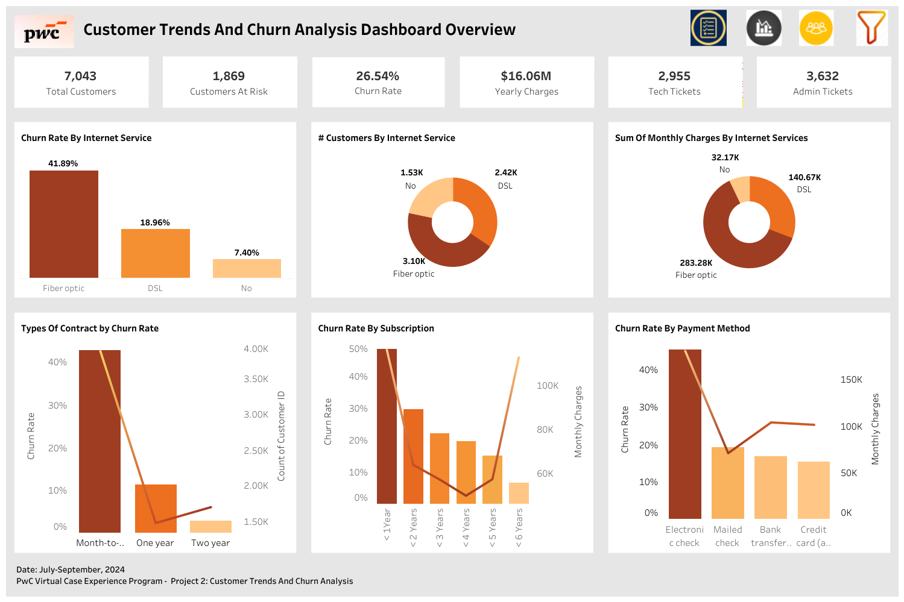

## Customer Trends And Churn Analysis

### Customer Retention Analysis (Call Now Customer Service Company)

This project combines **two analyses (2a & 2b)** focused on **customer retention and churn** for *Call Now Customer Service Company*.  

The analyses explored **customer demographics, payment methods, contract types, and service attributes** to identify **churn drivers** and recommend **strategies to improve retention and revenue stability**.  

---

### Project 2a: Customer Trends Analysis
### Project Overview 
Analyzed **customer demographics, account details, and subscribed services** to uncover key churn predictors.  
The focus was on how **subscription duration** and **payment methods** impacted customer retention.  

###  The Problem
High churn rates among **newer subscribers** and customers using **specific payment methods** were negatively impacting retention and long-term revenue growth.  

### Insights
-  **Subscribers with < 1 year tenure** had the highest churn rate at **53%**.  
-  **Electronic check payments** showed the highest churn at **57%**.  
-  **Subscription duration** and **payment method** were identified as **primary churn predictors**.  

###  Recommendations
-  Promote **automatic payments** with an **annual 5% incentive** to boost retention.  
-  Launch **targeted marketing campaigns** for **first-year subscribers** to reduce churn risk.  
-  Educate customers on more **reliable payment methods** (e.g., credit card, bank transfer).  

---

## Project 2b: Customer Churn Analysis
---
### Project Overview
Focused on **internet service type, contract length, and payment methods** to assess customer churn and long-term retention risks. 

---

###  The Problem
Rising churn among **month-to-month contracts** and **fiber optic customers** created risks to long-term **revenue stability**. 

---

### Insights
-  **Month-to-Month Contracts**: Highest churn rate at **43%**.  
-  **Fiber Optic Customers**: Churn rate at **41.9%**, indicating service dissatisfaction.  
-  **Longer contracts** correlated with **lower churn** and more stable revenue streams.

---

###  Recommendations
-  Increase sales of **one-year and two-year contracts** by at least **5% each**.  
-  Expand **technical support capacity** for fiber optic customers, aiming to **reduce support tickets by $0.50 per customer**.  
-  Offer **loyalty incentives** for short-term contract customers to switch to longer terms.  

---

### Skills Used
- **Data Understanding** – Explored customer attributes and churn data  
- **Data Cleaning** – Handled missing and inconsistent values  
- **Data Modelling** – Built churn driver models  
- **Data Analysis** – Identified high-risk churn segments  
- **Data Visualization** – Created Tableau dashboards for churn trends  
- **Dashboard Development** – Designed KPI tracking dashboards  
- **Data Storytelling** – Presented actionable strategies to leadership  

---

### Dashboard Preview

---

## Key Takeaway
The analyses revealed that **short-term contracts**, **fiber optic customers**, **new subscribers**, and **electronic check users** were at the **highest churn risk**.  

By targeting **payment methods**, **subscription tenure**, and **contract length**, *Call Now Customer Service Company* can **strengthen retention, stabilize revenue, and build long-term customer loyalty**. 

---
